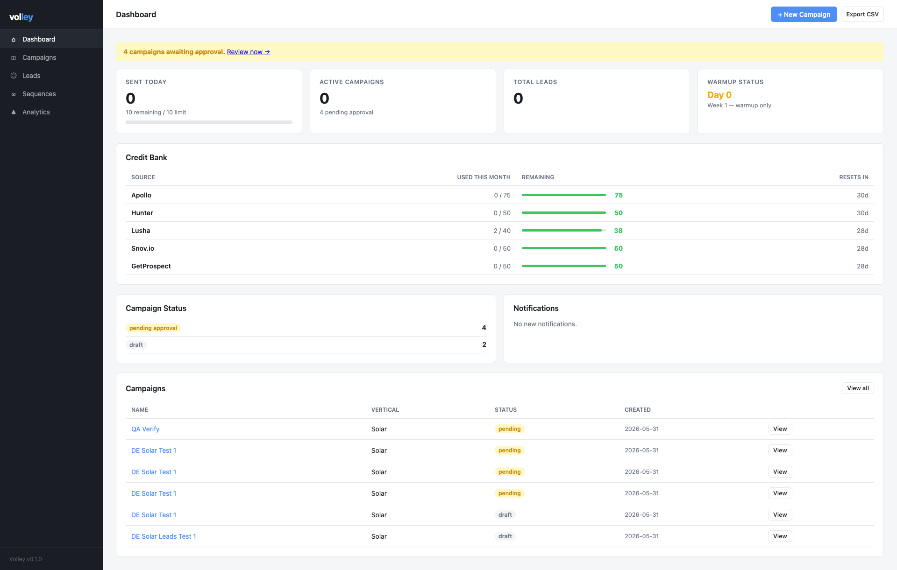

# Volley Outreach Agent

A production-ready, AI-powered cold outreach system built for a pay-per-lead agency. Finds prospective lead buyers, scores them against your ICP, generates personalised 4-email sequences using Claude, and manages the entire send cadence through a browser dashboard — all for roughly €1/month in running costs.



---

## What It Does

The agent handles the full outreach lifecycle end-to-end:

1. **Lead discovery** — queries Apollo.io, Hunter.io, Google Maps, and LinkedIn public profiles to find companies that match your ideal customer profile
2. **ICP scoring** — Claude Haiku analyses every lead and scores 0–100 for fit against your defined criteria
3. **Sequence generation** — writes a 4-email cadence (Day 0 / 4 / 10 / 18) tailored to the vertical, with subject lines, hooks, and CTAs
4. **Human approval** — you review the full strategy, lead list, and every email in the web dashboard before a single message goes out
5. **Automated sending** — the scheduler handles send windows, daily limits, randomised delays, and retry logic
6. **Reply detection** — Gmail inbox is polled every 15 minutes; any human reply immediately cancels all remaining steps for that lead

---

## Stack

| Layer | Tool | Cost |
|---|---|---|
| Lead sourcing | Apollo.io free tier (50 credits/mo), Hunter.io free tier | €0 |
| AI agents | Claude Haiku API (ICP analysis, copywriting, reply classification) | ~€0.02/campaign |
| CRM | Google Sheets API + SQLite | €0 |
| Email sending | Gmail SMTP via custom domain | €0 |
| Email warmup | Instantly.ai free trial → Lemwarm free tier | €0 |
| DNS & deliverability | Cloudflare free tier (SPF, DKIM, DMARC, Email Routing) | €0 |
| Dashboard | Flask + Jinja2, localhost:5000 | €0 |
| Domain | Namecheap / Porkbun | ~€10/year |
| **Total** | | **~€1/month** |

---

## Architecture

```
Browser → localhost:5000 (Flask dashboard)
              ↓
         main.py (web server + background scheduler)
              ↓
    ┌──────────────────────────────────┐
    │  Agents (Claude Haiku)           │
    │  ICP Analyzer                    │
    │  Lead Finder (Apollo / Hunter)   │
    │  Copywriter (4-email sequences)  │
    │  Reply Analyzer                  │
    └──────────────┬───────────────────┘
                   ↓
    ┌──────────────────────────────────┐
    │  Storage                         │
    │  SQLite (operational state)      │
    │  Google Sheets (human CRM view)  │
    └──────────────┬───────────────────┘
                   ↓
    ┌──────────────────────────────────┐
    │  Email                           │
    │  Weeks 1–2: Instantly / Lemwarm  │
    │  Week 3+:   Gmail SMTP           │
    └──────────────────────────────────┘
```

---

## Project Structure

```
outreach-agent/
├── main.py                     # Entry point — web server + scheduler
├── config.yaml                 # All config (API keys, limits, cadence)
│
├── agents/
│   ├── icp_analyzer.py         # ICP spec → structured Apollo search params
│   ├── lead_finder.py          # Multi-source lead discovery
│   ├── lead_enricher.py        # Email verification + ICP scoring
│   ├── strategy_generator.py   # Outreach angle + rationale
│   ├── copywriter.py           # 4-email sequence generation
│   └── reply_analyzer.py       # Human vs automated reply classification
│
├── integrations/
│   ├── apollo.py
│   ├── hunter.py
│   ├── google_sheets.py
│   ├── gmail_smtp.py
│   ├── instantly.py
│   ├── linkedin_scraper.py
│   └── google_maps.py
│
├── core/
│   ├── database.py             # SQLite schema + CRUD
│   ├── deduplicator.py
│   ├── email_validator.py
│   ├── scheduler.py            # Background send scheduler
│   └── reply_handler.py        # Human reply detection + sequence cancellation
│
├── web/
│   ├── app.py
│   ├── routes/                 # dashboard, campaigns, leads, sequences, analytics
│   └── templates/              # Jinja2 HTML templates
│
└── scripts/
    ├── setup.py                # One-command first-time setup
    └── dns_checker.py          # Verify SPF / DKIM / DMARC
```

---

## Key Design Decisions

**Human reply detection is built first and tested hardest.** The `reply_handler.py` module runs before any other processing. On detecting a human reply it immediately marks the lead as replied, cancels all scheduled future steps, updates both SQLite and Google Sheets, and surfaces a dashboard notification — all before the next poll cycle. False positives (cancelling a sequence for an OOO) are acceptable. False negatives (continuing to email someone who replied) are not.

**All secrets in `config.yaml`, nothing hardcoded.** A single flag (`warmup_active: false`) switches the sending provider from the warmup tool to Gmail SMTP without touching any code.

**API credit limits are hard stops, not warnings.** Usage is tracked per-source in SQLite. When a monthly limit is reached the agent falls through to the next source gracefully; it does not silently continue or error out.

**The approval flow is in the browser, not the terminal.** Every campaign goes through a pending → approved state transition in the dashboard. The operator reviews the full AI-generated strategy, all 4 emails, and the lead quality breakdown before approving. A "Send test to myself" button fires all 4 emails to the operator's own address first.

---

## Warmup Timeline

The only real time constraint before first sends is domain warmup.

| Period | Daily limit | Activity |
|---|---|---|
| Week 1–2 | 10–20 | Warmup only — no real prospects |
| Week 3 | 30 | 20 warmup + 10 real prospects |
| Week 4 | 40 | 10 warmup + 30 real prospects |
| Month 2+ | 50–80 | Warmup off, full Gmail SMTP |

---

## Setup

```bash
# 1. Clone and install
git clone https://github.com/yourhandle/outreach-agent
cd outreach-agent
python -m venv venv && source venv/bin/activate
pip install -r requirements.txt

# 2. Add API keys to config.yaml
# (Apollo, Hunter, Anthropic, Google, Gmail app password)

# 3. Run one-time setup
python scripts/setup.py

# 4. Verify DNS
python scripts/dns_checker.py --domain yourdomain.com

# 5. Start the agent
python main.py
# Dashboard at localhost:5000
```

---

## CLI Reference

```bash
python main.py                                    # Start web server + scheduler
python main.py find --icp "..." --limit 50        # Find and score leads
python main.py sync                               # Force sync SQLite ↔ Google Sheets
python main.py pause --campaign <id>
python main.py resume --campaign <id>
python main.py export --campaign <id>             # Export leads to CSV
python scripts/dns_checker.py --domain yourdomain.com
```

All campaign review and approval happens in the web dashboard. The CLI is for lead discovery and operational control.

---

## Deliverability Checklist

- SPF record: `v=spf1 include:_spf.google.com ~all`
- DMARC record: `v=DMARC1; p=none; rua=mailto:dmarc@yourdomain.com`
- DKIM signing via Cloudflare Email Routing (free)
- Google Postmaster Tools monitoring
- Bounce rate auto-pause at >5%
- Unsubscribe rate auto-pause at >2%
- Spam trigger word filter on every outgoing email (200+ phrases)

---

## Thresholds & Alerts

| Metric | Healthy | Auto-pause |
|---|---|---|
| Open rate | >30% | <15% after 50+ sends |
| Reply rate | >4% | — |
| Bounce rate | <2% | >5% |
| Spam rate | <0.05% | >0.1% |

Auto-pause writes a dashboard notification. Resuming is one click.

---

## Built With

- Python 3.11
- Flask + Jinja2
- SQLite + Google Sheets API
- Anthropic Claude Haiku API
- Apollo.io + Hunter.io REST APIs
- Playwright (LinkedIn public scraping)
- Cloudflare (DNS, Email Routing, DKIM)
- Chart.js (analytics dashboard)